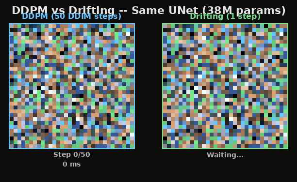
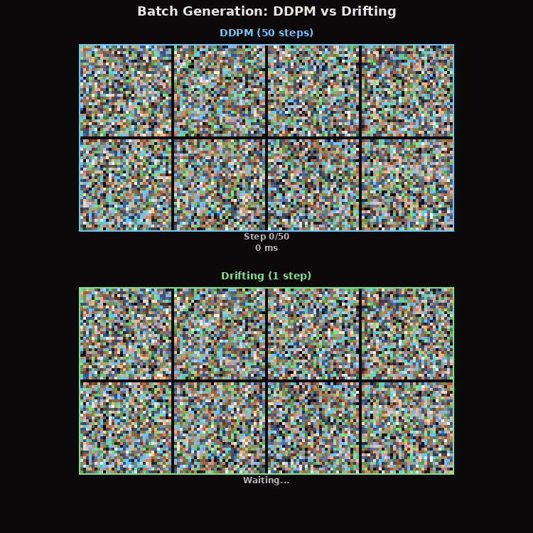

# Driftin

**Single-step image generation at 306 FPS on a consumer GPU.**

Drifting is a fundamentally different approach to generative modeling. Instead of iteratively denoising an image over 50-1000 steps like diffusion models, drifting generates a complete image in a **single forward pass** through the same neural network.

Same UNet. Same parameters. One step instead of fifty. **57x faster.**



## The Speed Gap is Absurd

We benchmarked both methods on the same 38M-parameter UNet on a single RTX 3090:

| Method | Steps | Latency (1 image) | FPS |
|--------|-------|--------------------|-----|
| DDPM (DDIM sampling) | 50 | 418 ms | 2.4 |
| **Drifting** | **1** | **3.26 ms** | **306** |

That's not a typo. **306 frames per second** for image generation on a consumer GPU, with `torch.compile` and zero other optimization. No TensorRT, no quantization, no custom kernels. Just one forward pass.

At batch size 128, drifting pushes **1,574 images per second** on a single 3090.

### Scaling to higher resolution

| Resolution | Latency | FPS | Notes |
|---|---|---|---|
| 32x32 | 3.3 ms | 306 | Current experiments |
| 64x64 | ~6 ms | ~160 | Extrapolated |
| 64x64 latent -> 512x512 | ~13 ms | ~77 | With VAE decoder |

For latent-space generation (like Stable Diffusion's architecture), drifting in 64x64 latent space + VAE decode to 512x512 could hit **77 FPS on a 3090**. On an H100, that's likely 150+ FPS.

**This means real-time video generation is not a distant dream -- it's an engineering problem with a clear path.**

## Why This Matters

Every video diffusion model today -- Sora, Kling, Runway -- generates frames through iterative denoising. That means generating a single frame takes hundreds of sequential neural network evaluations. Real-time? Impossible. Interactive? Forget it.

Drifting changes this equation entirely. If the quality gap can be closed through better training (bigger batch sizes, better feature encoders, more compute), we get:

- **Real-time AI video generation** at 30-60 FPS
- **AI-rendered game worlds** where every frame is generated, not rasterized
- **Interactive content creation** with zero latency
- **Edge deployment** on mobile GPUs

The quality isn't there yet at our current scale. But the architecture works, and the path to quality is clear: it's a training problem, not an inference problem.

## Results: CIFAR-10 Head-to-Head

We trained both DDPM and Drifting on CIFAR-10, sharing the exact same UNet backbone (38M params). Training was done on 8x H100 GPUs.


**DDPM** (top, blue): Sharp, detailed images after 50k training steps.

**Drift + ResNet-18** (middle, orange): Blurry but scene-like compositions. The drift field from ResNet-18 features (128D) provides weak learning signal.

**Drift + DINOv2** (bottom, green): Dramatic improvement. Recognizable animals, vehicles, landscapes. DINOv2's self-supervised features (768D) provide exactly the kind of visual nearest-neighbor signal that the drift kernel needs.

Key insight: **feature encoder quality matters more than batch size**. DINOv2 with 4x smaller batch (1024) produced better images than ResNet-18 with 4x larger batch (4096).

### Batch generation comparison



## How Drifting Works

Instead of learning to predict noise (diffusion), drifting learns to map noise directly to images in one shot. During training:

1. Generate images from noise via the UNet (single forward pass)
2. Extract features from both generated and real images using a frozen encoder (DINOv2)
3. Compute a **drift field** -- a weighted direction in feature space that pushes generated features toward real data features, using a softmax kernel over pairwise distances
4. Train the UNet so its output follows the drift field

The drift field is computed with **doubly-stochastic kernel normalization** and **temperature-dependent scaling**, which ensures the learning signal doesn't vanish in high-dimensional feature spaces.

At inference time, the feature encoder is not needed. It's just: `noise -> UNet -> image`. One pass.

### Why batch size matters for drifting

The drift field quality is proportional to how many samples participate in the kernel estimation. More samples = better estimate of where real data lives in feature space = stronger learning signal.

- 1 GPU, bs=128: weak drift signal, blobby results
- 8 GPUs, bs=4096: scene-like compositions
- Hypothetical 1000 GPUs, bs=500k: potentially state-of-the-art

This is the opposite of diffusion, where batch size mainly affects gradient noise. For drifting, **batch size IS the signal**. This means drifting is uniquely suited to massive-scale training -- the kind of compute that companies like OpenAI and Google already deploy for video models.

## Inference Optimization Results

Full benchmark on RTX 3090 with CUDA event timing (GPU-side, not wall clock):

| Method | bs=1 | bs=8 | bs=32 | bs=128 |
|---|---|---|---|---|
| Eager bf16 | 8.59 ms | 1.84 ms/img | 1.24 ms/img | 1.08 ms/img |
| torch.compile | 3.87 ms | 1.29 ms/img | 0.81 ms/img | 0.64 ms/img |
| **compile max-autotune** | **3.26 ms** | **1.08 ms/img** | **0.75 ms/img** | **0.64 ms/img** |

`torch.compile` with `max-autotune` gives a **2.6x speedup** over eager mode for free. The Triton autotuner selects optimal tile sizes for every convolution kernel.

And there's still headroom:
- TensorRT export: estimated 20-40% further improvement
- INT8 quantization: estimated 30-50% (single-step generation is more tolerant of quantization noise than iterative methods -- no error accumulation)
- CUDA graphs + compile combo: estimated 10-20%

Conservatively, with TensorRT + INT8, a 3090 could hit **500+ FPS at 32x32** or **100+ FPS at 512x512 via latent space**.

## Quick Start

### Single GPU (3090 / 4090 / etc.)

```bash
# Install
git clone https://github.com/infatoshi/driftin.git
cd driftin
pip install torch torchvision

# Train DDPM baseline (50k steps, ~2h on 3090)
python -m drifting_vs_diffusion.train_ddpm

# Train Drifting with DINOv2 features (50k steps, ~2.5h on 3090)
python -m drifting_vs_diffusion.train_drift --encoder dinov2 --use-features

# Benchmark inference
python bench_inference_full.py
```

### Multi-GPU (DDP)

```bash
# DDPM on 8 GPUs
torchrun --nproc_per_node=8 -m drifting_vs_diffusion.train_ddpm_ddp --steps 50000

# Drifting with DINOv2 on 8 GPUs (this is where drifting shines)
torchrun --nproc_per_node=8 -m drifting_vs_diffusion.train_drift_ddp \
    --encoder dinov2 --batch-size 128 --steps 50000

# Bigger batch = better drift signal. Use as many GPUs as you can get.
torchrun --nproc_per_node=8 -m drifting_vs_diffusion.train_drift_ddp \
    --encoder dinov2 --batch-size 512 --steps 100000
```

### Generate the comparison assets

```bash
# Speed comparison GIF
python make_gif.py

# Batch comparison GIF
python make_gif_batch.py

# Side-by-side comparison grid
python make_comparison.py
```

## Architecture

Both models use the same UNet:
- **38M parameters**
- base_ch=128, ch_mult=(1,2,2,2)
- 2 residual blocks per resolution
- Self-attention at 16x16
- Adaptive Group Normalization (AdaGN) for timestep conditioning

DDPM uses it for iterative noise prediction. Drifting uses it for single-step generation.

The feature encoder (DINOv2 ViT-B/14, 86M params, frozen) is only used during training. At inference, drifting is just the UNet alone.

## Repository Structure

```
drifting_vs_diffusion/
  config.py              # Model and training configs
  train_ddpm.py          # Single-GPU DDPM training
  train_ddpm_ddp.py      # Multi-GPU DDP DDPM training
  train_drift.py         # Single-GPU drifting training
  train_drift_ddp.py     # Multi-GPU DDP drifting (ResNet-18 + DINOv2)
  models/
    unet.py              # Shared UNet architecture
    ema.py               # Exponential moving average
  training/
    compute_v.py         # Drift field computation
    ddpm_utils.py        # DDPM noise schedule, DDIM sampling
  eval/
    sample.py            # Sampling utilities
    fid.py               # FID computation

benchmarks/              # Inference benchmark data (CSV + JSON)
assets/                  # GIFs and comparison images
DEVLOG.md                # Detailed development log with all experiments
```

## Development Log

See [DEVLOG.md](DEVLOG.md) for the full story: every experiment we ran, every bug we hit, every insight we gained. Includes:

- 5 training experiments on 8x H100 GPUs
- The discovery that pixel-space drifting fails due to the curse of dimensionality
- Why DINOv2 features are dramatically better than ResNet-18 for the drift kernel
- Comprehensive inference profiling with CUDA event timing
- Roadmap for kernel optimization (training and inference)

## What's Next

The quality gap between drifting and diffusion is real. But DINOv2 features closed a huge chunk of it, and we've only trained at CIFAR-10 scale with global batch 1024. The path forward:

1. **Scale batch size**: 1000+ GPUs, global batch 100k+. This directly improves drift signal quality.
2. **Better feature encoders**: SigLIP, DINOv2-giant, or task-specific encoders trained for drift compatibility.
3. **Latent-space drifting**: Operate on VAE latents instead of pixels. Enables higher resolution while keeping the drift field low-dimensional.
4. **Video**: Condition on previous frames. At 77 FPS in latent space on a 3090, real-time AI video is within reach.
5. **Inference optimization**: TensorRT, INT8, CUDA graphs. Push toward sub-millisecond generation.

The dream: train on 1000 GPUs for a month, serve on a single consumer GPU at 60 FPS. Diffusion fundamentally cannot do this. Drifting can.

## Acknowledgments

Multi-GPU training experiments were run on 8x H100 GPUs provided by [Voltage Park](https://www.voltagepark.com/). Thank you for the compute sponsorship.

## Citation

If you use this code or find our results useful:

```bibtex
@misc{driftin2026,
  title={Driftin: Single-Step Image Generation via Drift Fields},
  author={Elliot},
  year={2026},
  url={https://github.com/infatoshi/driftin}
}
```

## License

MIT
